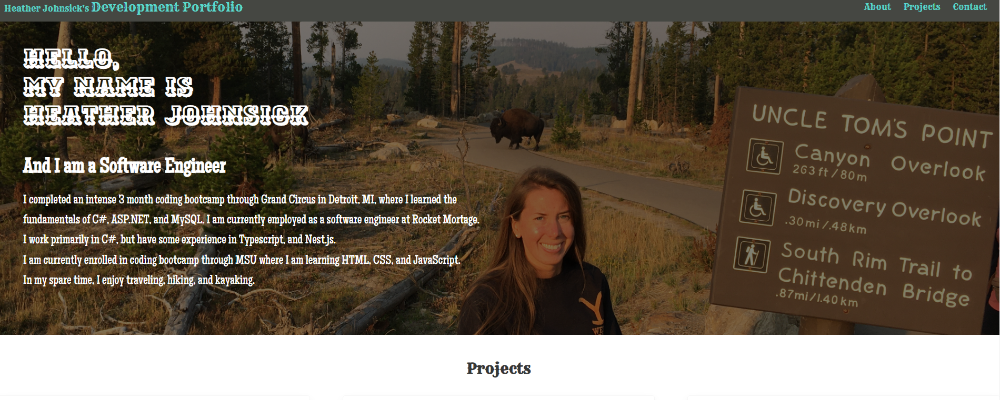

# Heather Johnsick's Developer Portfolio
As I continue to learn and create more projects, this portfolio will grow.  I plan on making this porfolio more modern and stylish as I expand my knowledge.

### Languages Used
HTML/CSS
### What I learned
While creating my portfolio, I learned how to use flex and media queries to make a responsive website.

This portfolio is deployed at [GitHub Pages](https://hjohnsick.github.io/development-portfolio/)
